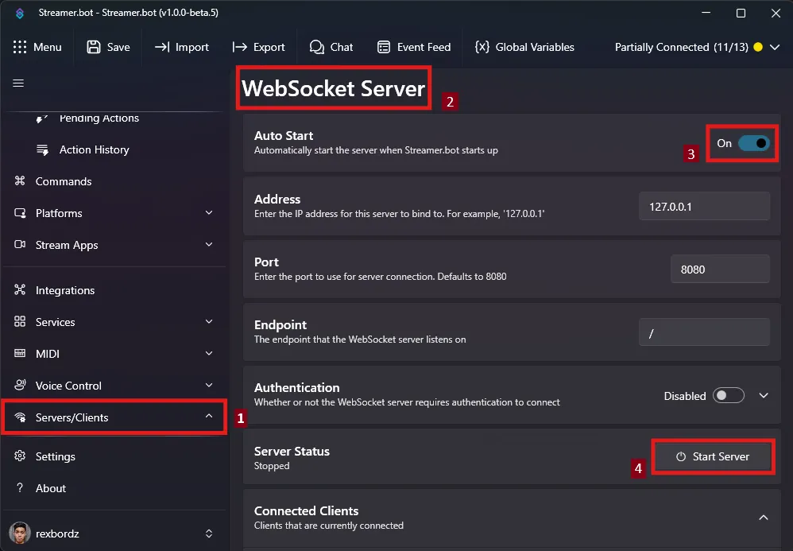
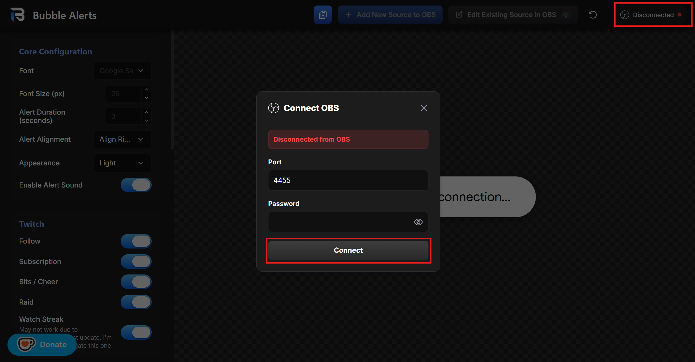
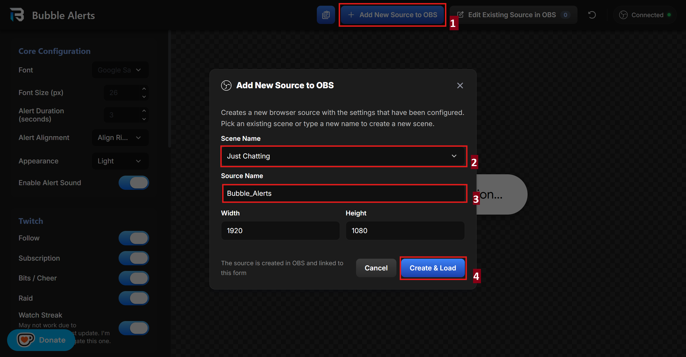
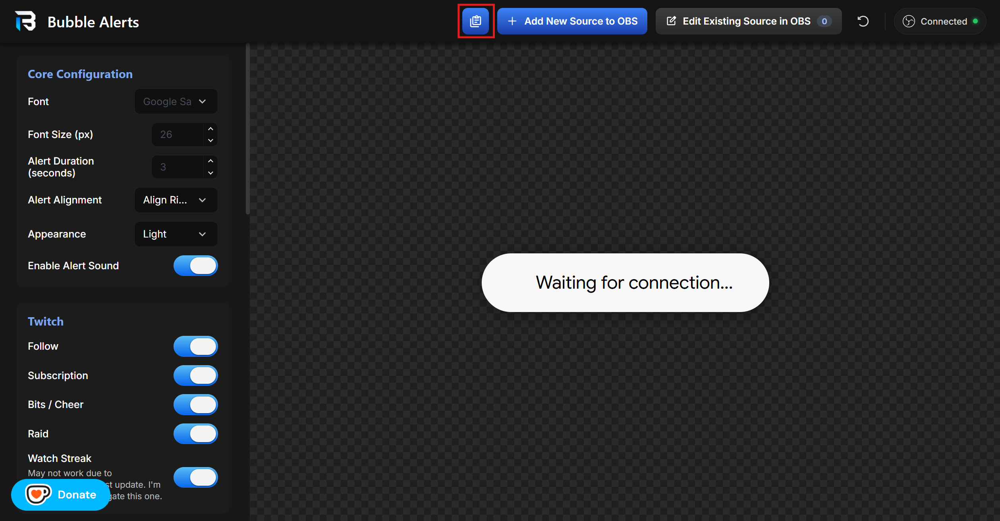
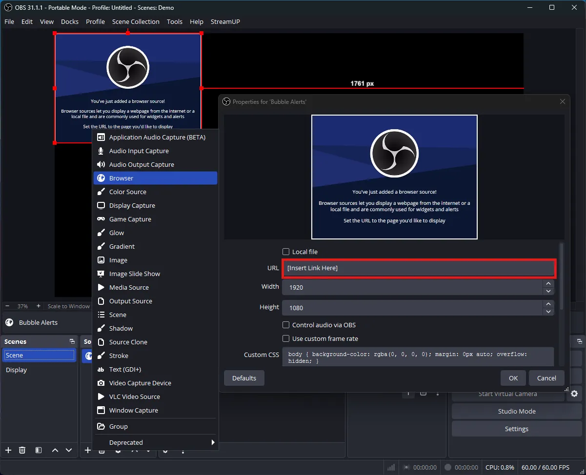
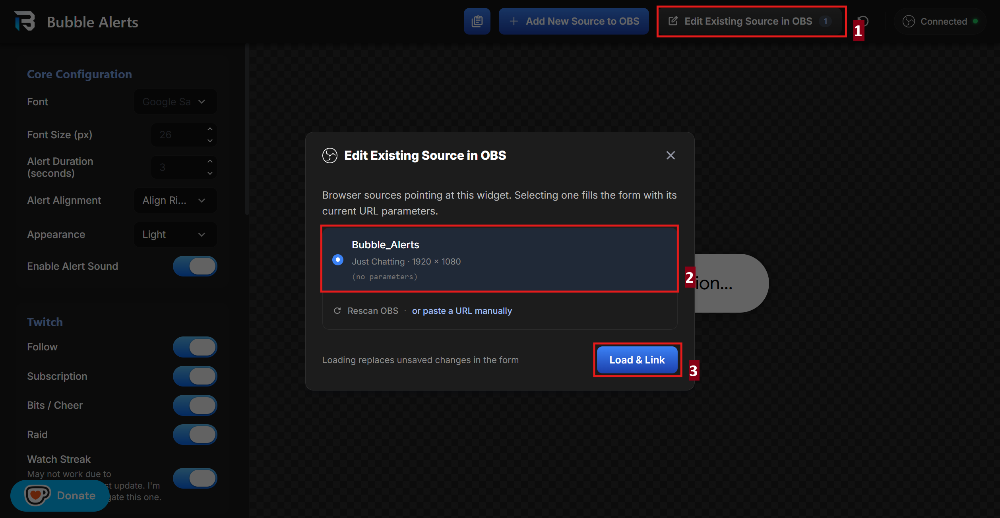
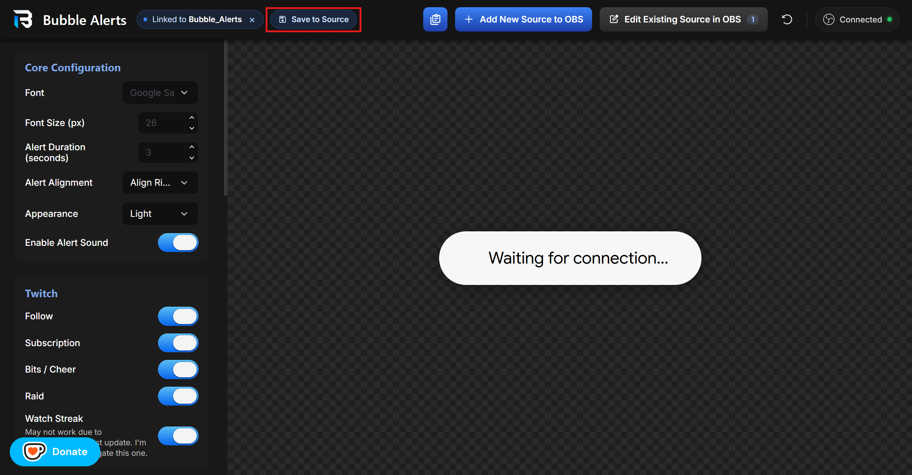

## Requirements

- **Streamer.bot** for Twitch, YouTube and Kick alerts
- **Tikfinity** for TikTok alerts

## Installation

### 1. Turn On Streamer.bot's WebSocket Server

### 2. Open Tikfinity (only for TikTok)

Tikfinity's WebSocket server is on by default so nothing else is required beyond this.

### 3. Configure Your Overlay

Open the settings page by clicking `Configure this widget in the settings editor` [here](#configure-widget).

Once in the settings page, configure the widget to your heart's desire.

### 4. Connect Your OBS to the Settings Page

If your OBS WebSocket settings is set to default, you shouldn't have to do anything after opening the settings page. However, in case your websocket's port is different and you have a password set, you can configure it here, and then just click `Connect`.

### 5. Add the Browser Source to OBS

There are 2 ways to accomplish this:

- **Method 1 (Recommended)**

  Click `Add New Source to OBS`, pick the **Scene**, set a **Source name**, and then click `Create & Load`

  

- **Method 2 (Traditional and Familiar)**

  Click the `Copy Current Settings URL` button and manually add the browser source into your OBS.

  

  

## Editing an Existing Browser Source

The settings page is programmed to detect any live browser source of the widget. To edit any existing one, just load that browser source by following the steps in the screenshot.

When you're done editing the settings, just click `Save to Source` and it will automatically update the browser source in OBS.

