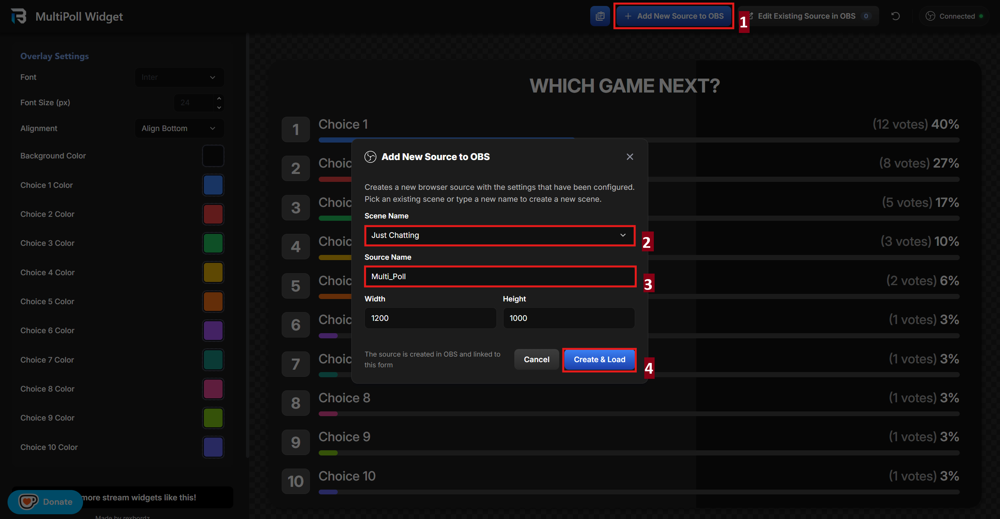
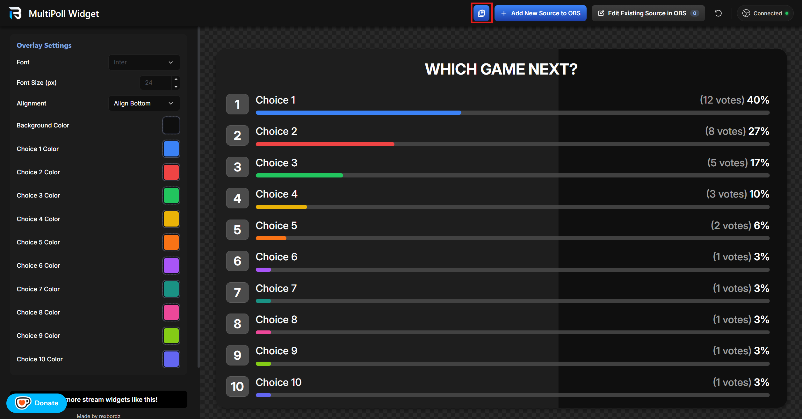
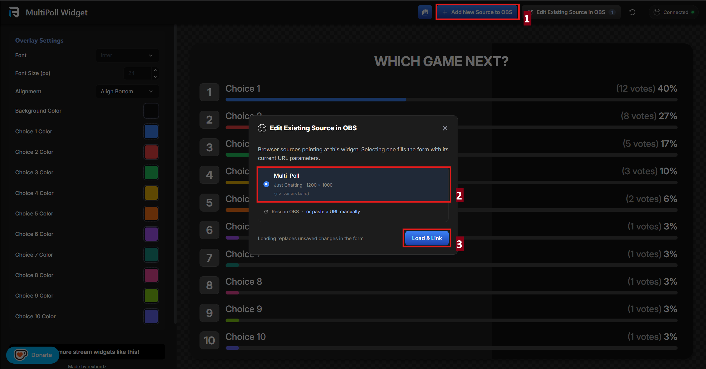
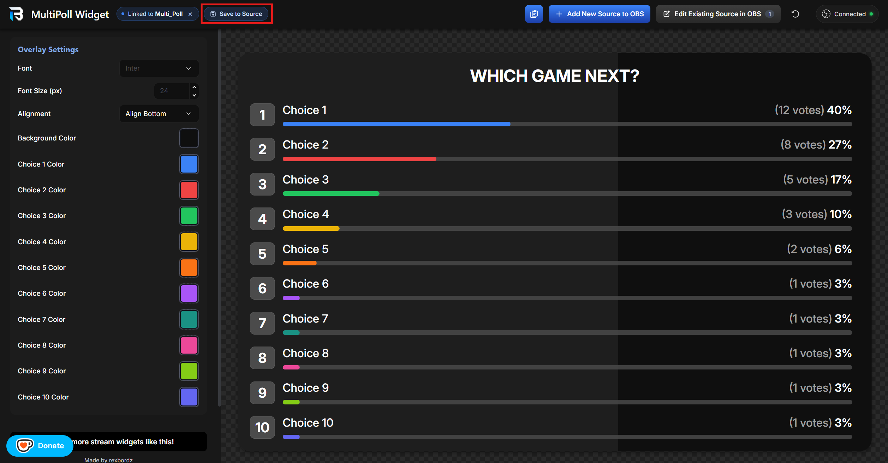

## Requirements

 **Streamer.Bot (For Twitch, YouTube, and/or Kick)** <br>
If you need help setting this up, visit their [website](https://streamer.bot/).

 **Tikfinity (For TikTok)** <br>
You need this to be able to listen to TikTok events. If you need help setting this up, you can check out my [Tikfinity Setup Guide](https://www.notion.so/Tikfinity-Setup-Guide-241088f4f93e8051b991c6ef4b659934?pvs=21).

## Video Tutorial
[](https://youtu.be/kynM8l7CP3o)

> [!NOTE]
> The video is a little bit outdated because this was made for the initial release. It still teaches the core of how to install it but there's more details down below.

##  Installation

### 1. Open Streamer.bot (For Twitch, YouTube or Kick)

You need to have WebSocket Server enabled:
        


        
### 2. Open TikFinity (For TikTok)

TikFinity’s WebSocket Server is on by default so there’s nothing else that needs to be done

### 3. Import Streamer.bot Actions

- Copy the [import code](https://github.com/rexbordz/rexbordz.github.io/blob/main/multi-poll/import.sb)
- Click `Import` and paste the code into the textbox

  

- Click `Import` and then just click `Yes` to all the prompts especially the last one

  

### 4. Configure Your Overlay

Open the settings page by clicking `Configure this widget in the settings editor` [here](#configure-widget).

Once in the settings page, configure the widget to your heart's desire.

### 5. Connect Your OBS to the Settings Page

If your OBS WebSocket settings is set to default, you shouldn't have to do anything after opening the settings page. However, in case your websocket's port is different and you have a password set, you can configure it here, and then just click `Connect`.

### 6. Add the Overlay to OBS

There are 2 ways to accomplish this:

- **Method 1 (Recommended)**

  Click `Add New Source to OBS`, pick the **Scene**, set a **Source name**, and then click `Create & Load`

  

- **Method 2 (Traditional and Familiar)**

  Click the `Copy Current Settings URL` button and manually add the browser source into your OBS.

  

  
  
### 7. Controller Dock

Copy the link below to add the controller as a Custom Browser Dock to your streaming software of choice. 
    
```xml
https://rexbordz.github.io/multi-poll/dashboard
```

        
### 8. Starting a Poll 

First two choices are required. When you’re ready, just click `Start Poll`.

<p align="center">
  
</p>


> [!TIP]
> ✅ **SUCCESS!** You have successfully installed Multipoll.

## Editing an Existing Browser Source

The settings page is programmed to detect any live browser source of the widget. To edit any existing one, just load that browser source by following the steps in the screenshot.



When you're done editing the settings, just click `Save to Source` and it will automatically update the browser source in OBS.



## Stream Deck

The actions are also compatible with Stream Deck. Just download the pre-made stream deck profiles I made [here](https://github.com/rexbordz/rexbordz.github.io/tree/main/multi-poll/streamdeck), and import the correct variant to your Stream Deck Software. Through the Streamer.bot integration, some of the buttons are responsive and know the state of your current poll.


## For the Nerds
> [!TIP]
> When you right click a **MultiPoll Widget • Poll Started** trigger and click **Requeue**, it will run that poll again with the same poll configuration.


<br>
<br>

> [!TIP]
> You can also get the import code and the download link for the stream deck profiles through this button. It will also show you the status of all the Streamer.bot actions associated with the poll. A yellow dot at the bottom right suggests that you're missing at least one action

<p align="center">

    

</p>

## Donate

Your donations help me create better content and improve stream quality! If you'd like to support my work and see more of it, you can donate through the following:

[](https://ko-fi.com/M4M3C7R1J)